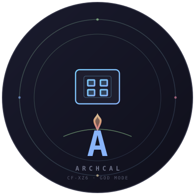

# calarch

<p align="center">
  
</p>

> ⚠️ **Chỉ dành cho Panasonic CF-XZ6 (CFXZ6-1 / i5-7300U / HD Graphics 620)** — không hỗ trợ laptop khác.

> Thiết lập Arch Linux chuyên biệt cho CF-XZ6: dual boot với Windows (giữ ESP `sda1` 512MiB),
> Dynamic CPU Affinity, Thermal tuning (undervolt -50/-20/-50mV cho 7300U), Btrfs + ZRAM, Super Mode daemon.

------------------------------------------------------------------------

## Tính năng

- **Unified TUI** — `bash start.sh` là entry point duy nhất cho tất cả:
  system monitor, settings, drive manager, wallpaper, focus mode, notes, games,
  rEFInd sync, profiles
- **Newbie-friendly Bootstrap** — Một lệnh cài đặt, auto WiFi connect, cheat-sheet
  archinstall, tự thích nghi bootloader/filesystem (dynamic rootflags)
- **Post-Install Setup** — Chạy tự động ở lần boot đầu tiên (live mode),
  không cần ISO chroot
- **God-Mode Guided Setup** — Lần login đầu tự mở checklist 8 bước: yay, Hyprland
  JaKooLit, ZRAM 8GB, undervolt, thermald+TLP, Super-Mode & Eco daemon, tweaks,
  ananicy-cpp — idempotent, chạy lại không lặp
- **Super Mode Daemon** — Tự động chuyển COOL (powersave) ↔ HOT (schedutil)
  theo CPU load
- **Dynamic CPU Affinity** — Active window → Core 0,1; Background → Core 2,3
- **Thermal God-Mode** — Undervolt -50/-20/-50mV, thermald + TLP
- **Btrfs + ZRAM 8GB** — Snapper snapshots, scrub timer, fstrim weekly,
  compress zstd:3
- **Bulletproof Safety** — Backup/rollback, grace period, boot guard,
  undo history
- **Config Center** — Mọi tham số tập trung tại một file `calarch.conf`
- **rEFInd ESP Kernel Sync** — Tự động copy kernel + initramfs ra ESP (FAT32),
  có pacman hook, hỗ trợ UKI mode
- **Terminal Media** — YouTube (yt-dlp + mpv), Anime từ Nyaa.si (magnet phát qua
  web-torrent engine `webtorrent-cli` dưới mpv — giữ mpv cho direct stream)
- **App Setup** — Spotify + Spicetify (adblock), Neovim + LazyVim (LSP),
  Rofi launcher, Firefox (vertical tabs + privacy), Emacs + Org-mode
- **Web Dashboard** — `python3 lib/web.sh` tại `localhost:8765`, quản lý config
  + trạng thái qua API core.sh

------------------------------------------------------------------------

## Cài đặt nhanh

Boot Arch USB (UEFI) rồi chạy một lệnh:

```bash
bash <(curl -s https://tpc-pascal.github.io/calarch/install)
```

Script tự kết nối mạng (hỏi SSID/password nếu chưa có) → archinstall TUI (bạn tự đặt
disk (`sda1` ESP giữ, `sda9` Btrfs CF-XZ6), hostname, **1 user thường (vd pascal) + password — KHONG chi root**, bootloader `rEFInd + uki:true`, font `ter-132n` HiDPI) → chọn Exit → calarch post-install tự động (bundle `~/calarch`).

> **Fallback:** `bash <(curl -s https://raw.githubusercontent.com/tpc-pascal/calarch/main/bootstrap.sh)`
>
> **Verify checksum:** `curl -sO https://tpc-pascal.github.io/calarch/install && echo "$(curl -s https://tpc-pascal.github.io/calarch/install.sha256)  install" | sha256sum -c - && bash install`

-----------------------------------------------------------------------

## Cấu trúc thư mục

```
calarch/
├── calarch.conf                 Config trung tâm
├── bootstrap.sh                 Bootstrap installer → archinstall TUI → post-install
├── start.sh                     Unified TUI — entry point duy nhất
├── make.sh                      Builder → calarch-v*.run
├── profiles/                    Preset: default, performance, battery, ultrafocus
├── web/                         Web dashboard (Chart.js)
├── tests/                       Bats test suite (tests/run.sh)
├── lib/
│   ├── tui.sh                   TUI engine (gum)
│   ├── core.sh                  Config I/O + Safety + Profile
│   ├── config-load.sh           Config loader cho các script con
│   ├── post-install.sh          Post-install setup (+ fix-partuuid, refind, CF-XZ6 snapper fix)
│   ├── fix-snapper.sh           Snapper @snapshots conflict recovery (CF-XZ6)
│   ├── godmode-setup.sh         God-Mode guided setup (8 bước, idempotent, CF-XZ6)
│   ├── godmode-cleanup.sh       Auto-maintenance (journal, cache, snapper)
│   ├── godmode-recovery.sh      Recovery & fallback handler
│   ├── system.sh                System monitor
│   ├── settings.sh              Settings panel (toggle services/apps)
│   ├── safety.sh                Safety engine UI
│   ├── dashboard.sh             Legacy dashboard (web + TUI)
│   ├── web.sh                   Web dashboard server (python, localhost:8765)
│   ├── super-mode.sh            Super Mode daemon
│   ├── hyprland-event-monitor.sh Dynamic CPU affinity engine (Hyprland)
│   ├── mount.sh                 Drive manager
│   ├── wallpaper.sh             Wallpaper changer (chafa preview)
│   ├── focus.sh                 Pomodoro + website blocker
│   ├── notes.sh                 Obsidian vault manager
│   ├── games.sh                 Games launcher
│   ├── refind-sync.sh           rEFInd ESP kernel sync (+ hook, UKI mode)
│   ├── anime.sh                 Anime player (Nyaa.si + web-torrent engine)
│   ├── yt-video.sh              Terminal YouTube player (yt-dlp + mpv)
│   ├── spotify.sh               Spotify + Spicetify
│   ├── neovim.sh                Neovim + LazyVim setup
│   ├── emacs.sh                 Emacs + Org-mode setup
│   ├── firefox.sh               Firefox config (vertical tabs + privacy)
│   ├── launcher.sh              Rofi Ultrafocus launcher
│   ├── kitty-ultrafocus.sh      Kitty terminal config
│   ├── cf-xz6-rotator.sh        Screen rotation (CF-XZ6)
│   ├── cfxz6-stylus-calibrate.sh Stylus calibration (CF-XZ6)
│   ├── ultrafocus-install.sh     App installer bundle
│   └── profiles.sh              Profile manager
├── assets/logo.svg
├── .github/workflows/
│   ├── tests.yml
│   ├── release.yml
│   └── deploy-pages.yml
├── CONTRIBUTING.md
├── CREDITS.md
├── GUIDE.md
├── README.md
└── LICENSE
```

------------------------------------------------------------------------

## Tech Stack

| Layer   | Công nghệ                                          |
|---------|-----------------------------------------------------|
| OS      | Arch Linux (linux-zen kernel)                       |
| Shell   | Bash 5.0+, `set -euo pipefail`                      |
| Desktop | Hyprland (Wayland) via JaKooLit                     |
| TUI     | gum (charmbracelet) — modern terminal UI            |
| Web     | Python + Chart.js (localhost:8765)                  |
| Media   | mpv, yt-dlp, webtorrent-cli                          |
| CPU     | taskset, chrt, ananicy-cpp                          |
| Thermal | thermald, TLP, intel-undervolt                      |
| Storage | Btrfs (zstd:3, noatime), ZRAM 8GB (zstd)            |
| AI      | Ollama (qwen2.5-coder) + OpenCode                   |
| Safety  | Grace period, boot guard, undo, history             |

------------------------------------------------------------------------

## Tác giả

**tpc-pascal** — [GitHub](https://github.com/tpc-pascal)

## License

MIT
